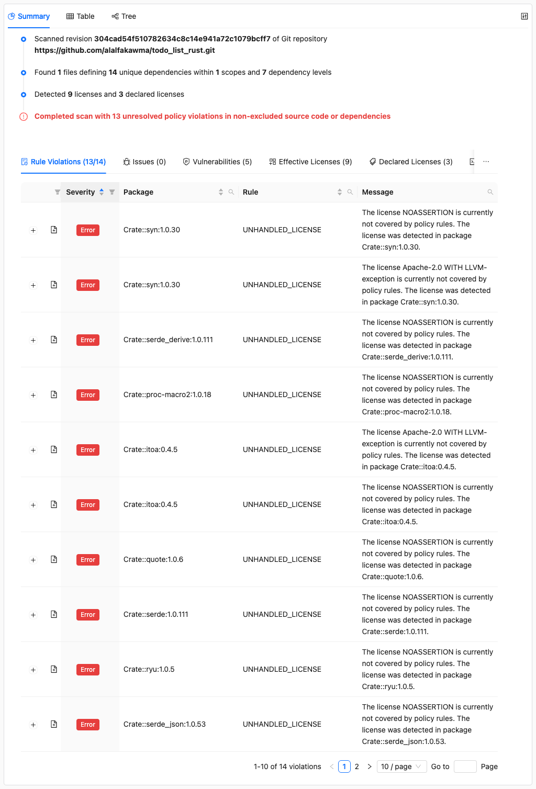

# Running Policy Checks

This is part of the [ORT Walkthrough tutorial](index.md). Make sure you've completed the [Advisor](advisor.md) step before continuing.

The Evaluator checks your scan results against policy rules. It uses a Kotlin-based rules script to define what licenses are allowed, which packages need review, and other compliance requirements.

## Setting up rules

ORT includes example rules that you can use as a starting point. Copy the example rules file into your config directory:

```shell
curl -o ort-config/rules.kts \
  https://raw.githubusercontent.com/oss-review-toolkit/ort/main/examples/example.rules.kts
```

## Running the Evaluator

```shell
docker run --rm \
  -v "$(pwd)/todo_list_rust":/workspace \
  -v "$(pwd)/ort-config":/home/ort/.ort/config \
  -v "$(pwd)/ort-output":/ort-output \
  ghcr.io/oss-review-toolkit/ort:76.0.0 \
  evaluate \
    --ort-file /ort-output/advisor-result.yml \
    --output-dir /ort-output \
    --rules-file /home/ort/.ort/config/rules.kts
```

New options:

| Option | Description |
|--------|-------------|
| `--rules-file` | The Kotlin script containing policy rules |

You should see output like this:

```
Looking for ORT configuration in the following file:
        /home/ort/.ort/config/config.yml (does not exist)

Looking for evaluator-specific configuration in the following files, directories and resources:
        /home/ort/.ort/config/copyright-garbage.yml
        /home/ort/.ort/config/license-classifications.yml
        /home/ort/.ort/config/resolutions.yml
        /home/ort/.ort/config/rules.kts
The following 14 rule violations have been found:
ERROR: UNHANDLED_LICENSE - Crate::syn:1.0.30 - NOASSERTION - The license NOASSERTION is currently not covered by policy rules. The license was detected in package Crate::syn:1.0.30.
ERROR: UNHANDLED_LICENSE - Crate::syn:1.0.30 - Apache-2.0 WITH LLVM-exception - The license Apache-2.0 WITH LLVM-exception is currently not covered by policy rules. The license was detected in package Crate::syn:1.0.30.
ERROR: UNHANDLED_LICENSE - Crate::serde_derive:1.0.111 - NOASSERTION - The license NOASSERTION is currently not covered by policy rules. The license was detected in package Crate::serde_derive:1.0.111.
ERROR: UNHANDLED_LICENSE - Crate::proc-macro2:1.0.18 - NOASSERTION - The license NOASSERTION is currently not covered by policy rules. The license was detected in package Crate::proc-macro2:1.0.18.
ERROR: UNHANDLED_LICENSE - Crate::itoa:0.4.5 - Apache-2.0 WITH LLVM-exception - The license Apache-2.0 WITH LLVM-exception is currently not covered by policy rules. The license was detected in package Crate::itoa:0.4.5.
ERROR: UNHANDLED_LICENSE - Crate::itoa:0.4.5 - NOASSERTION - The license NOASSERTION is currently not covered by policy rules. The license was detected in package Crate::itoa:0.4.5.
ERROR: UNHANDLED_LICENSE - Crate::quote:1.0.6 - NOASSERTION - The license NOASSERTION is currently not covered by policy rules. The license was detected in package Crate::quote:1.0.6.
ERROR: UNHANDLED_LICENSE - Crate::serde:1.0.111 - NOASSERTION - The license NOASSERTION is currently not covered by policy rules. The license was detected in package Crate::serde:1.0.111.
ERROR: UNHANDLED_LICENSE - Crate::ryu:1.0.5 - NOASSERTION - The license NOASSERTION is currently not covered by policy rules. The license was detected in package Crate::ryu:1.0.5.
ERROR: UNHANDLED_LICENSE - Crate::serde_json:1.0.53 - NOASSERTION - The license NOASSERTION is currently not covered by policy rules. The license was detected in package Crate::serde_json:1.0.53.
ERROR: UNHANDLED_LICENSE - Crate::serde_json:1.0.53 - Apache-2.0 WITH LLVM-exception - The license Apache-2.0 WITH LLVM-exception is currently not covered by policy rules. The license was detected in package Crate::serde_json:1.0.53.
WARNING: VULNERABILITY_IN_PACKAGE - Crate::ncurses:5.99.0 - The package Crate::ncurses:5.99.0 has a vulnerability
ERROR: MISSING_CONTRIBUTING_FILE - The project's code repository does not contain the file 'CONTRIBUTING.md'.
ERROR: MISSING_README_FILE - The project's code repository does not contain the file 'README.md'.
The evaluation of 1 script(s) took 6.894772254s.
Wrote evaluation result to '/ort-output/evaluation-result.yml' (0.17 MiB) in 157.140375ms.
Resolved rule violations: 0 errors, 0 warnings, 0 hints.
Unresolved rule violations: 13 errors, 1 warning, 0 hints.
There are 14 unresolved rule violations with a severity equal to or greater than the WARNING threshold.
```

The evaluator found 14 rule violations: unhandled licenses, a vulnerability warning, and missing project files.

## Viewing rule violations in the Web App

Generate a new web app report from the evaluator results:

```shell
docker run --rm \
  -v "$(pwd)/ort-config":/home/ort/.ort/config \
  -v "$(pwd)/ort-output":/ort-output \
  ghcr.io/oss-review-toolkit/ort:76.0.0 \
  -P ort.forceOverwrite=true \
  report \
    --ort-file /ort-output/evaluation-result.yml \
    --output-dir /ort-output \
    --report-formats WebApp
```

Open `ort-output/scan-report-web-app.html` in your browser.

### Rule violations



The Summary tab now shows a **Rule Violations** section listing all policy violations found by the evaluator. You can see unhandled licenses that need to be handled by your policy. See [How to address a license policy violation](../../how-to-guides/how-to-address-a-license-policy-violation.md) for details on resolving these.

## What's next

The evaluator has checked our project against policy rules. Now let's use the [Reporter](reporter.md) to generate SBOMs and NOTICE files for compliance documentation.

## Learn more

- [Evaluator CLI reference](../../reference/cli/evaluator.md) - All evaluator options
- [Evaluator rules](../../reference/configuration/evaluator-rules.md) - How to write custom rules
- [License classifications](../../reference/configuration/license-classifications.md) - Categorize licenses for rules
- [How to classify licenses](../../how-to-guides/how-to-classify-licenses.md) - Set up license categories
- [How to address a license policy violation](../../how-to-guides/how-to-address-a-license-policy-violation.md) - Handle rule violations
