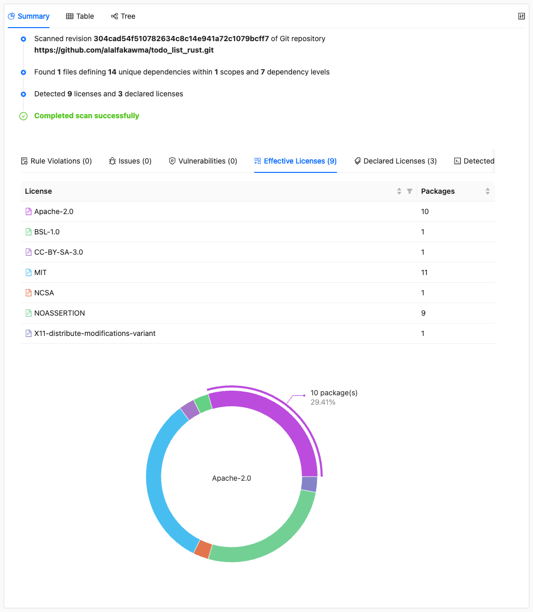
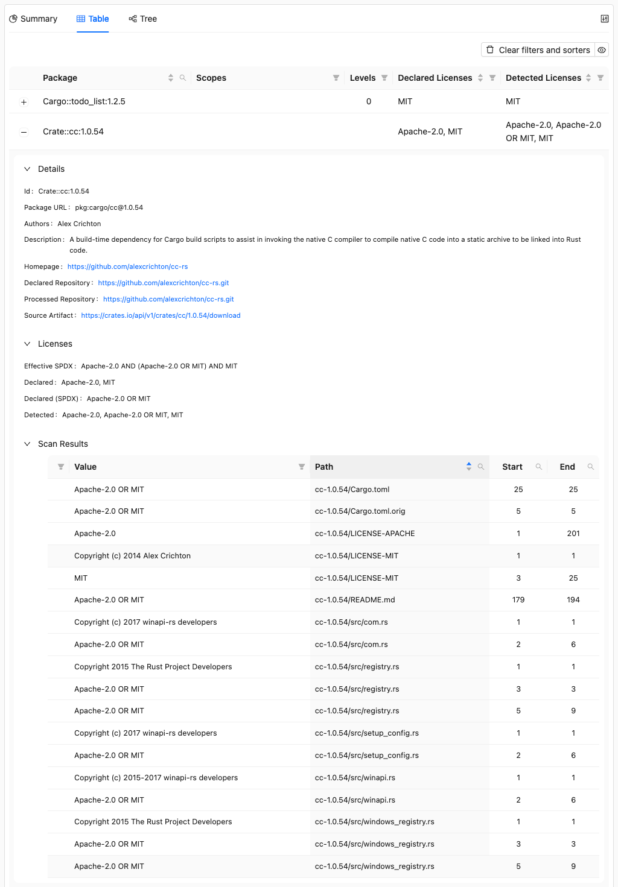

# Scanning for Copyrights and Licenses

This is part of the [ORT Walkthrough tutorial](index.md). Make sure you've completed the [Web App](web-app.md) step before continuing.

The Scanner downloads source code for each package and runs license scanners to detect licenses and copyrights in the actual source files. This goes beyond the declared licenses we saw in the analyzer results - it finds what's actually in the code.

The scanner automatically uses the [Downloader](../../reference/cli/downloader.md) to fetch source code before scanning. If you need to archive source code separately (e.g., for license compliance), see [How to download sources for projects and dependencies](../../how-to-guides/how-to-download-sources-for-projects-and-dependencies.md).

ORT supports several scanners. In this tutorial, we'll use [ScanCode](https://github.com/aboutcode-org/scancode-toolkit), which is included in the ORT Docker image.

## Running the Scanner

<!-- TODO: Remove ort.scanner.scanners.ScanCode.options.commandLineNonConfig, use release with #11324 PR -->

```shell
docker run --rm \
  -v "$(pwd)/todo_list_rust":/workspace \
  -v "$(pwd)/ort-config":/home/ort/.ort/config \
  -v "$(pwd)/ort-output":/ort-output \
  ghcr.io/oss-review-toolkit/ort:76.0.0 \
  -P ort.scanner.scanners.ScanCode.options.commandLineNonConfig=--timeout,300 \
  scan \
    --ort-file /ort-output/analyzer-result.yml \
    --output-dir /ort-output \
    --scanners ScanCode
```

New options:

| Option | Description |
|--------|-------------|
| `--ort-file` | The analyzer result to scan |
| `--scanners` | Which scanner(s) to use |

The scan takes a few minutes as it downloads and scans all packages. You should see output like this:

```
Looking for ORT configuration in the following file:
        /home/ort/.ort/config/config.yml (does not exist)

Scanning projects with:
        ScanCode (version 32.4.1)
Scanning packages with:
        ScanCode (version 32.4.1)
Wrote scan result to '/ort-output/scan-result.yml' (0.15 MiB) in 239.551292ms.
The scan took 1m 46.534437202s.
Resolved issues: 0 errors, 0 warnings, 0 hints.
Unresolved issues: 0 errors, 0 warnings, 0 hints.
```

## Viewing scan results in the Web App

Delete the old web app report and generate a new one from the scan results:

```shell
docker run --rm \
  -v "$(pwd)/ort-config":/home/ort/.ort/config \
  -v "$(pwd)/ort-output":/ort-output \
  ghcr.io/oss-review-toolkit/ort:76.0.0 \
  -P ort.forceOverwrite=true \
  report \
    --ort-file /ort-output/scan-result.yml \
    --output-dir /ort-output \
    --report-formats WebApp
```

Open `ort-output/scan-report-web-app.html` in your browser.

### Effective licenses



The Summary tab now shows **Effective Licenses** - the licenses actually found in the source code. Notice how they differ from the declared licenses we saw earlier. The scanner found licenses that weren't declared in the package metadata.

### Package scan details



Click on any package to see its scan results. The **Scan Results** section shows exactly which files contain license information and what was detected. This level of detail helps you understand where licenses come from and verify the findings.

<!-- TODO: Fix those and write about the results. -->
<!-- ## Refining scan results

Looking at the report in detail, we can see some issues that need attention:

1. **Multi-licensed packages**: Several packages like `Crate::unicode-xid:0.2.0` are licensed under `MIT OR Apache-2.0`. We can choose which license to use.
2. **Test files included in scan**: `Crate::unicode-xid:0.2.0` has license findings in `src/tests.rs`, which isn't part of the released package
3. **Undetermined license match**: `Crate::libc:0.2.71` has NOASSERTION findings in `README.md`, which contains text like "This project is licensed under either of"

### Making license choices

For multi-licensed packages, add a license choice to the project's `.ort.yml` file. See [How to make a license choice](../../how-to-guides/how-to-make-a-license-choice.md) for details. Create `todo_list_rust/.ort.yml`:

```yaml
license_choices:
  repository_license_choices:
  - given: "Apache-2.0 OR MIT"
    choice: "MIT"
```

This tells ORT to use the MIT license for all packages that offer `Apache-2.0 OR MIT`.

### Excluding test files and undetermined license match

We can fix these using [package configurations](../../reference/configuration/package-configurations.md). See [How to exclude dirs, files, or scopes](../../how-to-guides/how-to-exclude-dirs-files-or-scopes.md) and [How to correct licenses](../../how-to-guides/how-to-correct-licenses.md) for more details. Create the following files:

**`ort-config/package-configurations/Crate/_/unicode-xid/0.2.0/source-artifact.yml`**:

```yaml
id: "Crate::unicode-xid:0.2.0"
source_artifact_url: "https://crates.io/api/v1/crates/unicode-xid/0.2.0/download"
path_excludes:
- pattern: "unicode-xid-0.2.0/src/tests.rs"
  reason: "TEST_OF"
  comment: "Test file not included in released crate."
```

**`ort-config/package-configurations/Crate/_/libc/0.2.71/vcs.yml`**:

```yaml
id: "Crate::libc:0.2.71"
vcs:
  type: "Git"
  url: "https://github.com/rust-lang/libc.git"
  revision: "8712132baa9c487b229ff1489859f3ea21c70432"
license_finding_curations:
- path: "README.md"
  start_lines: "71"
  line_count: 1
  detected_license: "NOASSERTION"
  reason: "INCORRECT"
  comment: "Introductory text, not a license statement."
  concluded_license: "NONE"
- path: "README.md"
  start_lines: "95"
  line_count: 1
  detected_license: "NOASSERTION"
  reason: "INCORRECT"
  comment: "Contribution notice, not a license statement."
  concluded_license: "NONE"
```

After creating these files, delete the output directory and re-run the full pipeline to see the changes:

```shell
TODO:
  -P ort.forceOverwrite=true \
```

Then run the analyzer, scanner, and reporter again as shown earlier in this tutorial. The `.ort.yml` file will be picked up automatically by the analyzer, and the package configurations will be applied during report generation.

TODO: Document here how  to check what changed -->

## What's next

The scanner has revealed what licenses are actually in the code. Next, let's use the [Advisor](advisor.md) to check for known security vulnerabilities.

## Learn more

- [Scanner CLI reference](../../reference/cli/scanner.md) - All scanner options and storage backends
- [How to make a license choice](../../how-to-guides/how-to-make-a-license-choice.md) - Choose between multi-licensed options
- [How to correct licenses](../../how-to-guides/how-to-correct-licenses.md) - Fix incorrect license detections
- [How to exclude dirs, files, or scopes](../../how-to-guides/how-to-exclude-dirs-files-or-scopes.md) - Exclude files from analysis
- [Package configurations](../../reference/configuration/package-configurations.md) - Exclude files from scan results
